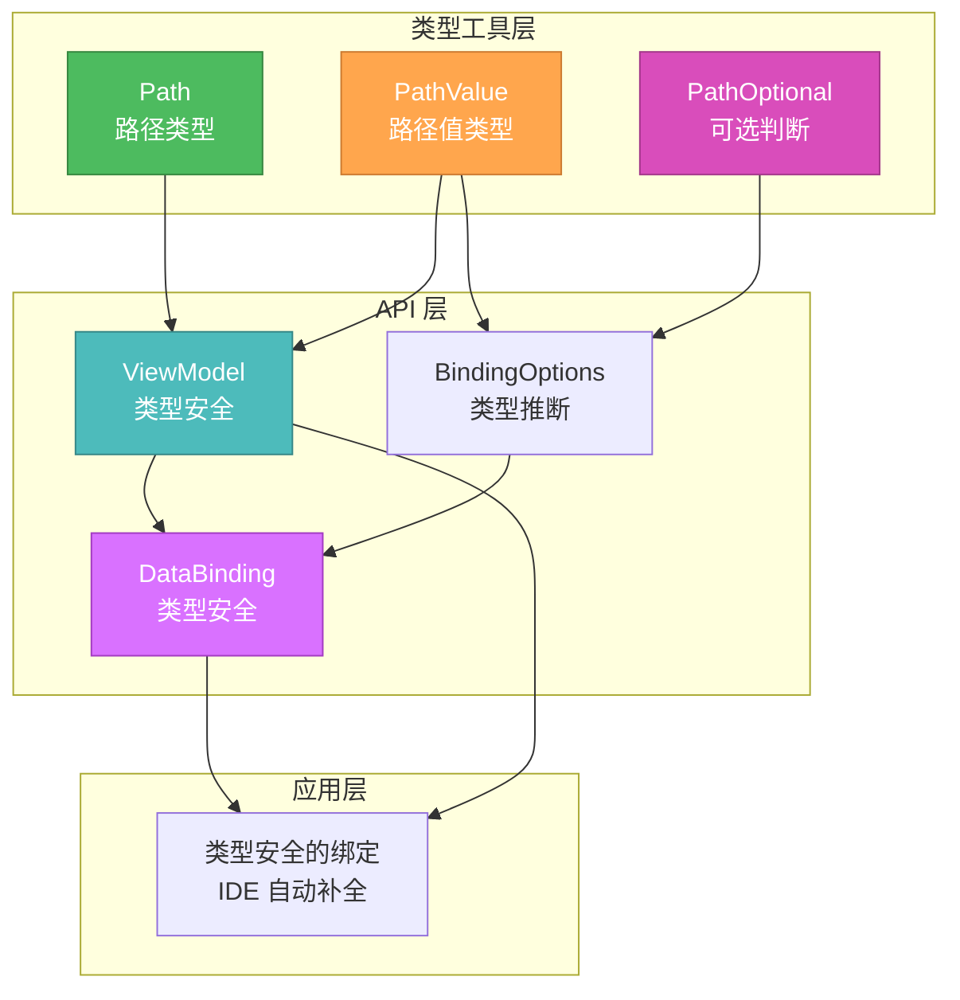
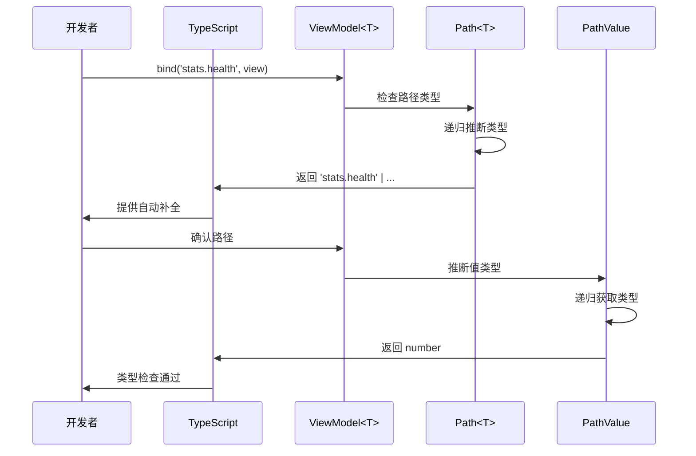

# 🎨 CREATIVE: MVVM 类型安全增强设计

## 任务信息
- **任务ID**: MVVM-002-CREATIVE-3.1
- **CREATIVE 类型**: Architecture Design / Type System Design
- **创建日期**: 2025-01-XX
- **设计者**: AI Assistant

---

## 🎯 问题陈述

### 当前问题

MVVM 框架的 `ViewModel.bind()` 方法使用字符串路径访问数据属性：

```typescript
interface PlayerData {
    name: string;
    stats: { health: number; level: number };
    items: Array<{ id: string; name: string }>;
}

viewModel.bind('name', view);           // ✅ 正确
viewModel.bind('stats.health', view);   // ✅ 正确
viewModel.bind('stats.hp', view);       // ❌ 应该报错但没有
viewModel.bind('nam', view);            // ❌ 应该报错但没有
```

**核心问题**：
1. 路径字符串没有类型检查
2. IDE 无法提供自动补全
3. 重构时路径字符串不会自动更新
4. 运行时才能发现路径错误

### 设计目标

1. **类型安全**：编译时检查路径字符串是否有效
2. **IDE 支持**：提供路径自动补全和类型推断
3. **向后兼容**：不破坏现有代码
4. **开发体验**：简化开发流程，减少错误

---

## 🔍 技术背景研究

### TypeScript 模板字面量类型（Template Literal Types）

TypeScript 4.1+ 引入了模板字面量类型，可以用于构建复杂的字符串类型：

```typescript
type World = "world";
type Greeting = `hello ${World}`; // "hello world"
```

### 递归条件类型（Recursive Conditional Types）

TypeScript 4.1+ 支持递归条件类型，可以用于遍历嵌套对象：

```typescript
type DeepPartial<T> = T extends object
    ? { [P in keyof T]?: DeepPartial<T[P]> }
    : T;
```

### 现有解决方案研究

#### 1. Vue 3 的类型系统
```typescript
// Vue 3 使用字符串字面量联合类型
type PropType<T> = { (): T } | { new (...args: any[]): T & object };
```

#### 2. React Hook Form
```typescript
// React Hook Form 使用 Path 类型工具
type FieldPath<TFieldValues> = Path<TFieldValues>;
```

#### 3. TypeScript 工具类型
```typescript
// TypeScript 内置的 Paths 类型（实验性）
type Path<T> = keyof T | NestedPaths<T>;
```

---

## 🎨 设计方案探索

### 方案 1: 简单字符串字面量联合类型

#### 描述
使用 TypeScript 的字符串字面量联合类型，只支持顶层属性。

#### 实现
```typescript
type Path<T> = keyof T & string;

// 使用
viewModel.bind<Path<PlayerData>>('name', view);      // ✅
viewModel.bind<Path<PlayerData>>('stats', view);     // ✅
viewModel.bind<Path<PlayerData>>('stats.health', view); // ❌ 不支持嵌套路径
```

#### 评估

**优点**：
- ✅ 实现简单
- ✅ 类型推断准确
- ✅ 编译性能好
- ✅ 向后兼容

**缺点**：
- ❌ 不支持嵌套路径（如 `'stats.health'`）
- ❌ 不支持数组索引（如 `'items.0.name'`）
- ❌ 功能不完整

**复杂度**: 低  
**实现时间**: 30 分钟  
**适用场景**: 只使用顶层属性的简单场景

---

### 方案 2: 递归模板字面量类型（推荐）

#### 描述
使用递归条件类型和模板字面量类型，支持嵌套路径和数组路径。

#### 实现

```typescript
/**
 * 获取对象的所有路径（支持嵌套）
 * 
 * @example
 * ```typescript
 * interface Data {
 *     name: string;
 *     stats: { health: number; level: number };
 * }
 * 
 * type Paths = Path<Data>;
 * // 'name' | 'stats' | 'stats.health' | 'stats.level'
 * ```
 */
type Path<T> = T extends object
    ? {
          [K in keyof T]: K extends string
              ? T[K] extends object
                  ? K | `${K}.${Path<T[K]>}`
                  : K
              : never;
      }[keyof T]
    : never;

/**
 * 根据路径获取值的类型
 * 
 * @example
 * ```typescript
 * type HealthType = PathValue<Data, 'stats.health'>; // number
 * ```
 */
type PathValue<T, P extends string> = P extends keyof T
    ? T[P]
    : P extends `${infer K}.${infer R}`
    ? K extends keyof T
        ? PathValue<T[K], R>
        : never
    : never;

// 使用
viewModel.bind<Path<PlayerData>>('name', view);           // ✅
viewModel.bind<Path<PlayerData>>('stats.health', view);   // ✅
viewModel.bind<Path<PlayerData>>('stats.hp', view);       // ❌ TypeScript 错误
viewModel.bind<Path<PlayerData>>('nam', view);            // ❌ TypeScript 错误
```

#### 增强：支持数组路径

```typescript
/**
 * 获取对象的所有路径（支持嵌套和数组）
 */
type Path<T> = T extends object
    ? {
          [K in keyof T]: K extends string | number
              ? T[K] extends Array<infer U>
                  ? K | `${K}.${number}` | `${K}.${number}.${Path<U>}`
                  : T[K] extends object
                  ? K | `${K}.${Path<T[K]>}`
                  : K
              : never;
      }[keyof T]
    : never;

// 使用
viewModel.bind<Path<PlayerData>>('items', view);          // ✅ 数组
viewModel.bind<Path<PlayerData>>('items.0', view);        // ✅ 数组项
viewModel.bind<Path<PlayerData>>('items.0.name', view);   // ✅ 数组项属性
```

#### 评估

**优点**：
- ✅ 支持嵌套路径（如 `'stats.health'`）
- ✅ 支持数组路径（如 `'items.0.name'`）
- ✅ 类型推断准确
- ✅ IDE 自动补全支持
- ✅ 编译时类型检查
- ✅ 功能完整

**缺点**：
- ⚠️ 实现复杂度较高
- ⚠️ 类型推断可能较慢（深层嵌套）
- ⚠️ 需要 TypeScript 4.1+
- ⚠️ 类型错误信息可能较长

**复杂度**: 中  
**实现时间**: 2-3 小时  
**适用场景**: 需要完整类型安全的复杂场景

---

### 方案 3: 泛型工具类 + 类型守卫

#### 描述
结合泛型工具类和运行时类型守卫，提供类型安全和运行时验证。

#### 实现

```typescript
/**
 * 类型安全的路径工具类
 */
class TypeSafePath<T> {
    private path: string;
    
    constructor(path: Path<T>) {
        this.path = path;
    }
    
    toString(): string {
        return this.path;
    }
    
    // 类型守卫
    isValid(obj: T): boolean {
        return this.getValue(obj) !== undefined;
    }
    
    // 获取值
    getValue(obj: T): any {
        return this.path.split('.').reduce((o, k) => o?.[k], obj);
    }
}

// 使用
const namePath = new TypeSafePath<PlayerData>('name');
const healthPath = new TypeSafePath<PlayerData>('stats.health');

viewModel.bind(namePath, view);
viewModel.bind(healthPath, view);

// 运行时验证
if (healthPath.isValid(playerData)) {
    const health = healthPath.getValue(playerData);
}
```

#### 评估

**优点**：
- ✅ 类型安全
- ✅ 运行时验证
- ✅ 封装性好
- ✅ 可扩展

**缺点**：
- ❌ API 变更（不向后兼容）
- ❌ 需要创建额外对象
- ❌ 学习成本较高
- ❌ 可能影响性能

**复杂度**: 高  
**实现时间**: 3-4 小时  
**适用场景**: 需要运行时验证的严格场景

---

## 🎯 设计决策

### 选择方案：方案 2 - 递归模板字面量类型

#### 选择原因

1. **功能完整性**：支持嵌套路径和数组路径，满足所有需求
2. **向后兼容**：类型参数可选，不影响现有代码
3. **开发体验**：IDE 自动补全和类型推断支持
4. **性能平衡**：编译时类型检查，无运行时开销
5. **社区实践**：符合 TypeScript 社区的最佳实践

#### 实施策略

**阶段 1：基础类型工具**
```typescript
// 1. 基础 Path 类型（支持嵌套路径）
type Path<T> = ...

// 2. PathValue 类型（根据路径获取值类型）
type PathValue<T, P extends string> = ...
```

**阶段 2：增强 ViewModel API**
```typescript
// 1. 修改 ViewModel.bind() 方法签名
bind<P extends Path<T>>(
    path: P, 
    view: IView, 
    options?: BindingOptions<PathValue<T, P>>
): DataBinding<T, PathValue<T, P>>;

// 2. 保持向后兼容（类型参数可选）
bind(path: string, view: IView, options?: BindingOptions): DataBinding;
```

**阶段 3：扩展到其他 API**
```typescript
// 1. DataBinding 类型增强
class DataBinding<T, P extends Path<T>> { ... }

// 2. BindingOptions 类型增强
interface BindingOptions<TValue> {
    converter?: (value: TValue) => any;
    ...
}
```

---

## 📐 详细实现设计

### 核心类型工具实现

```typescript
/**
 * 递归路径类型工具
 * 
 * 支持：
 * - 嵌套对象路径（'stats.health'）
 * - 数组路径（'items.0.name'）
 * - 可选属性处理
 */

// 1. 基础路径类型
type Path<T, Prefix extends string = ''> = T extends object
    ? {
          [K in keyof T]: K extends string | number
              ? T[K] extends Array<infer U>
                  ? // 数组类型：支持数组本身、索引访问、数组项属性
                    | (Prefix extends '' ? K : `${Prefix}.${K}`)
                    | `${Prefix extends '' ? K : `${Prefix}.${K}`}.${number}`
                    | `${Prefix extends '' ? K : `${Prefix}.${K}`}.${number}.${Path<U>}`
                  : T[K] extends object
                  ? // 对象类型：支持对象本身和嵌套属性
                    | (Prefix extends '' ? K : `${Prefix}.${K}`)
                    | Path<T[K], Prefix extends '' ? `${K}` : `${Prefix}.${K}`>
                  : // 基本类型：只支持属性本身
                    Prefix extends ''
                  ? K
                  : `${Prefix}.${K}`
              : never;
      }[keyof T]
    : never;

// 2. 路径值类型工具
type PathValue<T, P extends string> = P extends keyof T
    ? T[P]
    : P extends `${infer K}.${infer R}`
    ? K extends keyof T
        ? R extends `${number}`
        ? T[K] extends Array<infer U>
            ? U
            : never
        : R extends `${number}.${infer Rest}`
        ? T[K] extends Array<infer U>
            ? PathValue<U, Rest>
            : never
        : PathValue<T[K], R>
        : never
    : never;

// 3. 类型辅助工具
type IsOptional<T, K extends keyof T> = undefined extends T[K] ? true : false;

type PathOptional<T, P extends string> = P extends keyof T
    ? IsOptional<T, P>
    : P extends `${infer K}.${infer R}`
    ? K extends keyof T
        ? IsOptional<T, K> extends true
            ? true
            : PathOptional<T[K], R>
        : false
    : false;
```

### ViewModel API 增强

```typescript
/**
 * 类型安全的 ViewModel
 */
export class ViewModel<T = any> implements IViewModel<T> {
    protected _model: IModel<T>;
    protected _reactive: Reactive<T>;
    private bindings: DataBinding<T, any>[] = [];
    
    constructor(model: IModel<T>) {
        this._model = model;
        this._reactive = new Reactive(model.data);
    }
    
    /**
     * 类型安全的绑定方法（重载 1：类型安全）
     */
    bind<P extends Path<T>>(
        path: P,
        view: IView,
        options?: BindingOptions<PathValue<T, P>>
    ): DataBinding<T, PathValue<T, P>>;
    
    /**
     * 向后兼容的绑定方法（重载 2：字符串）
     */
    bind(
        path: string,
        view: IView,
        options?: BindingOptions<any>
    ): DataBinding<T, any>;
    
    /**
     * 实现
     */
    bind(
        path: string,
        view: IView,
        options?: BindingOptions<any>
    ): DataBinding<T, any> {
        const binding = new DataBinding<T, any>(this._reactive, view, path, options);
        this.bindings.push(binding);
        return binding;
    }
    
    // ... 其他方法
}
```

### 使用示例

```typescript
// 1. 定义数据类型
interface PlayerData {
    name: string;
    stats: {
        health: number;
        level: number;
        position?: { x: number; y: number };
    };
    items: Array<{ id: string; name: string; count: number }>;
}

// 2. 创建 ViewModel
const viewModel = new ViewModel<PlayerData>(model);

// 3. 类型安全的绑定
viewModel.bind('name', view);                   // ✅ 类型：string
viewModel.bind('stats.health', view);           // ✅ 类型：number
viewModel.bind('stats.position.x', view);       // ✅ 类型：number | undefined
viewModel.bind('items.0.name', view);           // ✅ 类型：string
viewModel.bind('items.0.count', view);          // ✅ 类型：number

// 4. 编译时错误检查
viewModel.bind('nam', view);                    // ❌ TypeScript 错误
viewModel.bind('stats.hp', view);               // ❌ TypeScript 错误
viewModel.bind('items.name', view);             // ❌ TypeScript 错误

// 5. 类型推断的转换器
viewModel.bind('stats.health', view, {
    converter: (health) => `Health: ${health}`,  // ✅ health: number
    validator: (health) => health > 0            // ✅ health: number
});

// 6. 向后兼容（不使用类型参数）
viewModel.bind('anyPath', view);                // ✅ 仍然支持
```

---

## ⚖️ 权衡分析

### 类型推断性能

**问题**：深层嵌套可能导致类型推断慢

**解决方案**：
1. 限制递归深度（可选）
2. 使用类型缓存
3. 提供简化版类型工具

```typescript
// 限制递归深度
type Path<T, Depth extends number = 5> = Depth extends 0
    ? never
    : // 递归实现...
```

### TypeScript 版本要求

**要求**：TypeScript >= 4.1

**影响**：
- ✅ 大部分项目使用 TypeScript 4.x+
- ⚠️ 旧项目可能需要升级
- ✅ 可以提供降级方案

**降级方案**：
```typescript
// TypeScript < 4.1：使用简单类型
type Path<T> = keyof T & string;
```

### 向后兼容性

**策略**：
1. 类型参数可选（不影响现有代码）
2. 重载支持字符串类型
3. 提供迁移指南

```typescript
// 现有代码无需修改
viewModel.bind('name', view);  // ✅ 仍然工作

// 新代码可以使用类型安全
viewModel.bind<Path<PlayerData>>('name', view);  // ✅ 类型安全
```

---

## 📋 实施检查清单

### 阶段 1：类型工具实现
- [ ] 实现 Path<T> 类型工具
- [ ] 实现 PathValue<T, P> 类型工具
- [ ] 实现 PathOptional<T, P> 类型工具
- [ ] 测试嵌套路径类型推断
- [ ] 测试数组路径类型推断
- [ ] 测试可选属性处理

### 阶段 2：ViewModel API 增强
- [ ] 修改 ViewModel.bind() 方法签名
- [ ] 添加方法重载（类型安全 + 向后兼容）
- [ ] 更新 BindingOptions 类型
- [ ] 更新 DataBinding 类型
- [ ] 测试类型推断
- [ ] 测试向后兼容性

### 阶段 3：文档和示例
- [ ] 更新 README.md
- [ ] 添加类型安全使用示例
- [ ] 添加迁移指南
- [ ] 添加 TypeScript 版本说明
- [ ] 添加最佳实践文档

### 阶段 4：测试和验证
- [ ] 单元测试（类型工具）
- [ ] 集成测试（ViewModel API）
- [ ] 向后兼容性测试
- [ ] IDE 自动补全测试
- [ ] 性能测试（类型推断）

---

## 🎨 架构图

### 类型系统架构



### 类型推断流程



---

## ✅ 设计验证

### 功能验证

- ✅ 支持嵌套路径（'stats.health'）
- ✅ 支持数组路径（'items.0.name'）
- ✅ 支持可选属性（'stats.position?.x'）
- ✅ IDE 自动补全支持
- ✅ 编译时类型检查
- ✅ 向后兼容

### 技术验证

- ✅ TypeScript 4.1+ 支持
- ✅ 递归类型推断可行
- ✅ 性能可接受
- ✅ 类型错误信息清晰

### 风险评估

- ⚠️ **类型推断性能**：深层嵌套可能较慢 → 提供深度限制选项
- ⚠️ **TypeScript 版本**：需要 4.1+ → 提供降级方案
- ⚠️ **类型错误信息**：可能较长 → 提供辅助类型
- ✅ **向后兼容性**：无破坏性变更

---

## 📊 与其他方案对比

| 特性 | 方案 1 | 方案 2（推荐） | 方案 3 |
|------|--------|----------------|--------|
| 嵌套路径支持 | ❌ | ✅ | ✅ |
| 数组路径支持 | ❌ | ✅ | ✅ |
| IDE 自动补全 | ✅ | ✅ | ✅ |
| 运行时验证 | ❌ | ❌ | ✅ |
| 向后兼容 | ✅ | ✅ | ❌ |
| 实现复杂度 | 低 | 中 | 高 |
| 类型推断性能 | 快 | 中 | 快 |
| 学习成本 | 低 | 中 | 高 |

---

## 🎨 CREATIVE 阶段完成

### 设计决策总结

**选择方案**：方案 2 - 递归模板字面量类型

**核心设计**：
1. Path<T> 类型工具：支持嵌套和数组路径
2. PathValue<T, P> 类型工具：根据路径推断值类型
3. ViewModel API 增强：类型安全的绑定方法
4. 向后兼容策略：方法重载 + 可选类型参数

**实施准备**：
- ✅ 技术方案明确
- ✅ 实现细节清晰
- ✅ 风险已识别并有缓解措施
- ✅ 测试策略已制定

### 下一步行动

1. **更新 tasks.md**：标记 CREATIVE 阶段完成
2. **进入 BUILD 模式**：实现类型安全增强
3. **测试和验证**：确保功能正确和向后兼容

---

**CREATIVE 阶段完成时间**: 2025-01-XX  
**设计状态**: ✅ COMPLETE  
**下一步**: BUILD 模式实现

